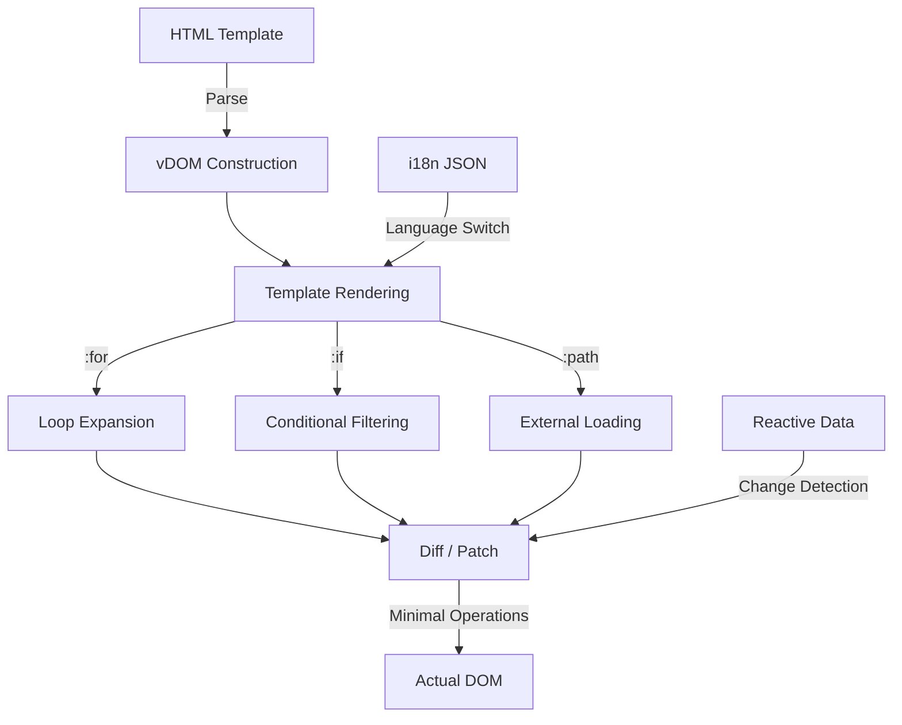

> [!NOTE]
> This README was generated by [SKILL](https://github.com/pardnchiu/skill-readme-generate), get the ZH version from [here](./README.zh.md).


# QuickUI

[](https://www.npmjs.com/package/@pardnchiu/quickui)
[](https://www.jsdelivr.com/package/npm/@pardnchiu/quickui)

> A lightweight frontend framework built on pure JavaScript and native APIs, delivering efficient rendering and reactive data binding through virtual DOM.

## Table of Contents

- [Features](#features)
- [Architecture](#architecture)
- [File Structure](#file-structure)
- [License](#license)
- [Author](#author)
- [Stars](#stars)

## Features

> `npm i @pardnchiu/quickui` · [Documentation](./doc.md)

### Zero-Dependency Virtual DOM Engine

Built entirely on pure JavaScript and native browser APIs without any third-party libraries. A self-implemented virtual DOM diff/patch algorithm minimizes DOM operations for view updates, delivering high rendering performance while maintaining an extremely small bundle size.

### Declarative Template Syntax

Use intuitive syntax such as `{{value}}`, `:for`, `:if`/`:else-if`/`:else` directly in HTML templates for data binding, loop rendering, and conditional rendering. Developers can implement dynamic view logic with minimal code, without learning additional build tools or template engines.

### Reactive Data with i18n Support

Automatically detects data changes and triggers minimal-scope view updates, eliminating tedious manual DOM manipulation. Built-in i18n support enables multi-language switching through JSON locale files and `i18n.key` syntax, removing the need for additional translation frameworks.

## Architecture



## File Structure

```
QuickUI/
├── dist/
│   ├── QuickUI.js            # Minified build
│   ├── QuickUI.esm.js        # ESM build
│   └── QuickUI.css           # Stylesheet
├── src/
│   ├── function/             # Utility functions
│   ├── listener/             # Observers (Lazyload, SVG)
│   ├── model/                # Core classes (QUI, vDOM, Lifecycle)
│   └── interface.ts          # Type definitions
├── static/                   # Demo site assets
├── page/                     # Demo pages
├── package.json
└── README.md
```

## License

This project is licensed under the [Software Usage Agreement](LICENSE).

## Author


<h4 style="padding-top: 0">邱敬幃 Pardn Chiu</h4>

<a href="mailto:dev@pardn.io" target="_blank">

</a> <a href="https://linkedin.com/in/pardnchiu" target="_blank">

</a>

## Stars

[](https://www.star-history.com/#pardnchiu/QuickUI&Date)

***

©️ 2024 [邱敬幃 Pardn Chiu](https://linkedin.com/in/pardnchiu)
