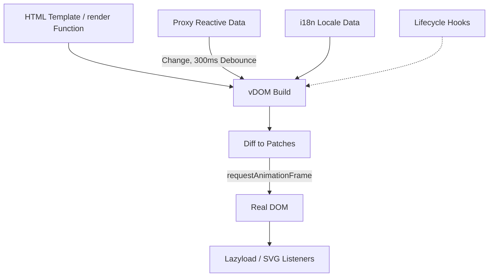

> [!NOTE]
> This README was generated by [SKILL](https://github.com/agenvoy/skill-readme-generate), get the ZH version from [here](./doc/README.zh.md).

***

<strong>A ZERO-DEPENDENCY VIRTUAL DOM FRAMEWORK THAT RUNS WITHOUT A BUILD STEP</strong>

***

> A vanilla JavaScript frontend framework with virtual DOM diffing, declarative HTML templates, and runtime i18n

## Table of Contents

- [Features](#features)
- [Architecture](#architecture)
- [License](#license)
- [Author](#author)

## Features

> `npm i @pardnchiu/quickui` · [Documentation](./doc/doc.md)

- **Zero dependencies, no build step** — Native browser APIs power the virtual DOM diff/patch engine, so a single script tag brings it to any existing page.
- **Declarative HTML templates** — Interpolation, loops, conditionals, two-way binding, and event binding live directly in HTML attributes, so the template is the page itself.
- **Batched Proxy reactivity** — Deep data mutations trigger a 300ms debounced update that applies only the required DOM patches on the next animation frame.
- **Runtime i18n switching** — Locales accept either inline objects or JSON file URLs, and a single language switch re-renders both text and attributes.
- **Built-in lazy images and inline SVG** — IntersectionObserver defers image loading behind a placeholder animation and inlines external SVG files as stylable nodes once they enter the viewport.

## Architecture

> [Full Architecture](./doc/architecture.md)

```mermaid
graph TB
    A[HTML Template / render Function] --> B[vDOM Build]
    D[Proxy Reactive Data] -->|Change, 300ms Debounce| B
    E[i18n Locale Data] --> B
    B --> C[Diff to Patches]
    C -->|requestAnimationFrame| F[Real DOM]
    G[Lifecycle Hooks] -.-> B
    F --> H[Lazyload / SVG Listeners]
```

## License

This project is licensed under the [MIT LICENSE](LICENSE).

## Author

Just [open an issue](https://github.com/pardnchiu/QuickUI/issues/new) to share an idea.

***

©️ 2024 [邱敬幃 Pardn Chiu](https://www.linkedin.com/in/pardnchiu)
