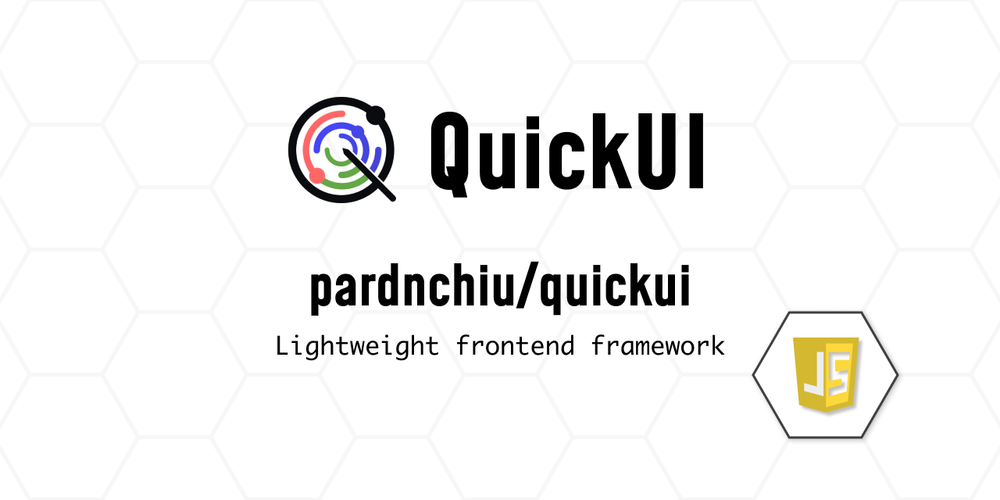

# QuickUI: 輕量化前端框架

[](https://github.com/pardnchiu)
[](https://www.npmjs.com/package/@pardnchiu/quickui)
[](https://www.jsdelivr.com/package/npm/@pardnchiu/quickui)

> QuickUI 是一個基於純 JavaScript 和原生 API 的輕量級前端框架，支持數據綁定、國際化 (i18n)、事件綁定、條件渲染以及循環渲染功能。

> [!NOTE]
> (原名：PDQuickUI，自 `0.6.0` 版本起更名為 QuickUI)

## 核心特色

### 高效虛擬 DOM
- 透過精準的差異比對算法實現高效 DOM 更新
- 智慧屬性更新系統，只更新發生變化的值
- 智能子節點對比機制，最小化 DOM 操作

### 響應式數據處理
- 深度數據監控系統，確保數據變更即時反映
- 數據變更時自動更新 UI，無需手動操作
- 智慧緩存系統避免不必要的重複渲染
- 支援巢狀數據結構的響應式處理

### 進階模板功能
- 內建多語系（i18n）支援，輕鬆實現國際化
- 支援動態載入模板並非同步處理
- 強大的表達式系統，支援計算、日期和文字處理
- 完整的指令系統實現靈活的 DOM 操作

### 效能優化設計
- 圖片和 SVG 內容採用懶加載技術，提升載入速度
- 極小的檔案體積且無外部依賴
- 智慧事件委派和資源清理機制，優化記憶體使用

## 文件

- 網站: [quickui.pardn.io](https://quickui.pardn.io/)
- 說明文件: [quickui.pardn.io/page/doc.html](https://quickui.pardn.io/page/doc.html)

## 安裝方式

### 從 npm 安裝
```shell
npm i @pardnchiu/quickui
```

### 從 CDN 引入

#### 引入 `QuickUI` 套件
```html
<!-- 0.6.0 版本以上 -->
<script src="https://cdn.jsdelivr.net/npm/@pardnchiu/quickui@[VERSION]/dist/QuickUI.js"></script>

<!-- 0.5.4 版本以下 -->
<script src="https://cdn.jsdelivr.net/npm/pdquickui@[VERSION]/dist/PDQuickUI.js"></script>
```

#### Module 版本
```javascript
// 0.6.0 版本以上
import { QUI } from "https://cdn.jsdelivr.net/npm/@pardnchiu/quickui@[VERSION]/dist/QuickUI.esm.js";

// 0.5.4 版本以下
import { QUI } from "https://cdn.jsdelivr.net/npm/pdquickui@[VERSION]/dist/PDQuickUI.module.js";
```
        
## 使用方法

### 初始化 `QUI`
```Javascript
const app = new QUI({
    id: "", // 指定渲染元素
    data: {
        // 自訂 DATA
    },
    event: {
        // 自訂 EVENT
    },
    when: {
        beforeRender: function () {
            // 停止渲染
        },
        rendered: function () {
            // 已渲染
        },
        beforeUpdate: function () {
            // 停止更新
        },
        updated: function () {
            // 已更新
        },
        beforeDestroy: function () {
            // 停止銷毀
        },
        destroyed: function () {
            // 已銷毀
        }
    }
});
```

### 模板渲染
- index.html
    ```HTML
    <body id="app"></body>
    <script>
        const test = new QUI({
            id: "app",
            data: {
                hint: "hint 123",
                title: "test 123"
            },
            render: () => `
                "{{ hint }}",
                h1 {
                    style: "background: red;", 
                    children: [ 
                        "{{ title }}"
                    ]
                }`
        })
    </script>
    ```
- result
    ```HTML
    <body id="app">
        hint 123
        <h1 style="background: red;">test 123</h1>
    </body>
    ```

### 屬性概覽

#### 文字與內容
| 屬性 | 使用場景 | 範例 |
|-----------|----------|---------|
| `{{ value }}` | 動態文字內容 | `<p>{{ userName }}</p>` 顯示使用者名稱 |
| `:html` | 原始 HTML 插入 | `<div :html="richContent"></div>` 渲染格式化內容 |

#### 模板載入
| 屬性 | 使用場景 | 範例 |
|-----------|----------|---------|
| `:path` | 外部模板載入 | `<temp :path="'./templates/header.html'"></temp>` 載入頁首元件 |

#### 列表與迭代
| 屬性 | 使用場景 | 範例 |
|-----------|----------|---------|
| `:for` | 陣列/物件迭代 | `<li :for="item in items">{{ item.name }}</li>` 渲染列表項目 |

#### 條件渲染
| 屬性 | 使用場景 | 範例 |
|-----------|----------|---------|
| `:if` | 條件顯示 | `<div :if="isLoggedIn">歡迎！</div>` |
| `:else-if`/`:elif` | 次要條件 | `<div :elif="isPending">載入中...</div>` |
| `:else` | 預設內容 | `<div :else>請登入</div>` |

#### 表單綁定
| 屬性 | 使用場景 | 範例 |
|-----------|----------|---------|
| `:model` | 雙向資料綁定 | `<input :model="userInput">` 與資料同步 |

#### 樣式與動畫
| 屬性 | 使用場景 | 範例 |
|-----------|----------|---------|
| `:animation` | 過渡效果 | `<div :animation="fade-in">內容</div>` |
| `:[css]` | 動態樣式 | `<div :background-color="bgColor">樣式內容</div>` |

#### 動態屬性
| 屬性 | 使用場景 | 範例 |
|-----------|----------|---------|
| `:[attr]` | 動態屬性 | `` |

#### 事件處理
| 屬性 | 使用場景 | 範例 |
|-----------|----------|---------|
| `@[event]` | 事件監聽器 | `<button @click="handleClick">點擊我</button>` |

## 授權條款

本專案採用類 MIT 授權，但僅提供混淆後的程式碼：
- 與 MIT 相同：可自由使用、修改、再散布，包含商業用途
- 主要差異：預設僅提供混淆版程式碼，原始碼需另外購買
- 授權內容：必須保留原始版權聲明 (與 MIT 相同)

詳細條款與條件請參閱[軟體使用協議](https://github.com/pardnchiu/QuickUI/blob/main/LICENSE)。

## 開發者


<h4 style="padding-top: 0">邱敬幃 Pardn Chiu</h4>

<a href="mailto:dev@pardn.io" target="_blank">
    
</a> <a href="https://linkedin.com/in/pardnchiu" target="_blank">
    
</a>

## 星

[](https://www.star-history.com/#pardnchiu/QuickUI&Date)

***

©️ 2023 [邱敬幃 Pardn Chiu](https://www.linkedin.com/in/pardnchiu)