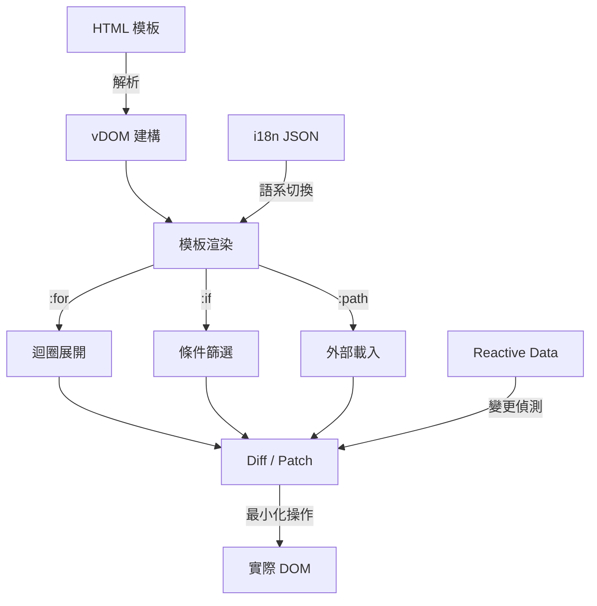

> [!NOTE]
> 此 README 由 [SKILL](https://github.com/pardnchiu/skill-readme-generate) 生成，英文版請參閱 [這裡](./README.md)。


# QuickUI

[](https://www.npmjs.com/package/@pardnchiu/quickui)
[](https://www.jsdelivr.com/package/npm/@pardnchiu/quickui)

> 基於純 JavaScript 與原生 API 的輕量化前端框架，透過虛擬 DOM 實現高效渲染與響應式資料綁定。

## 目錄

- [功能特點](#功能特點)
- [架構](#架構)
- [檔案結構](#檔案結構)
- [授權](#授權)
- [Author](#author)
- [Stars](#stars)

## 功能特點

> `npm i @pardnchiu/quickui` · [完整文件](./doc.zh.md)

### 零依賴虛擬 DOM 引擎

完全以純 JavaScript 搭配瀏覽器原生 API 建構，不依賴任何第三方函式庫。透過自實作的虛擬 DOM Diff/Patch 演算法，以最小化的 DOM 操作完成畫面更新，在保持極小封裝體積的同時提供高效的渲染效能。

### 宣告式模板語法

直接在 HTML 模板中使用 `{{value}}`、`:for`、`:if`/`:else-if`/`:else` 等直覺語法完成資料綁定、迴圈渲染與條件渲染。開發者無需學習額外的編譯工具或模板引擎，即可用最少的程式碼實現動態畫面邏輯。

### 響應式資料與多語系支援

資料變更時自動偵測差異並觸發最小範圍的畫面更新，省去手動操作 DOM 的繁瑣流程。同時內建 i18n 機制，透過 JSON 語系檔與 `i18n.key` 語法即可實現多語系切換，無需額外整合翻譯框架。

## 架構



## 檔案結構

```
QuickUI/
├── dist/
│   ├── QuickUI.js            # 壓縮版建置
│   ├── QuickUI.esm.js        # ESM 建置
│   └── QuickUI.css           # 樣式表
├── src/
│   ├── function/             # 工具函式
│   ├── listener/             # 觀察器（Lazyload、SVG）
│   ├── model/                # 核心類別（QUI、vDOM、Lifecycle）
│   └── interface.ts          # 型別定義
├── static/                   # 展示網站資源
├── page/                     # 展示頁面
├── package.json
└── README.md
```

## 授權

本專案採用 [Software Usage Agreement](LICENSE)。

## Author


<h4 style="padding-top: 0">邱敬幃 Pardn Chiu</h4>

<a href="mailto:dev@pardn.io" target="_blank">

</a> <a href="https://linkedin.com/in/pardnchiu" target="_blank">

</a>

## Stars

[](https://www.star-history.com/#pardnchiu/QuickUI&Date)

***

©️ 2024 [邱敬幃 Pardn Chiu](https://linkedin.com/in/pardnchiu)
