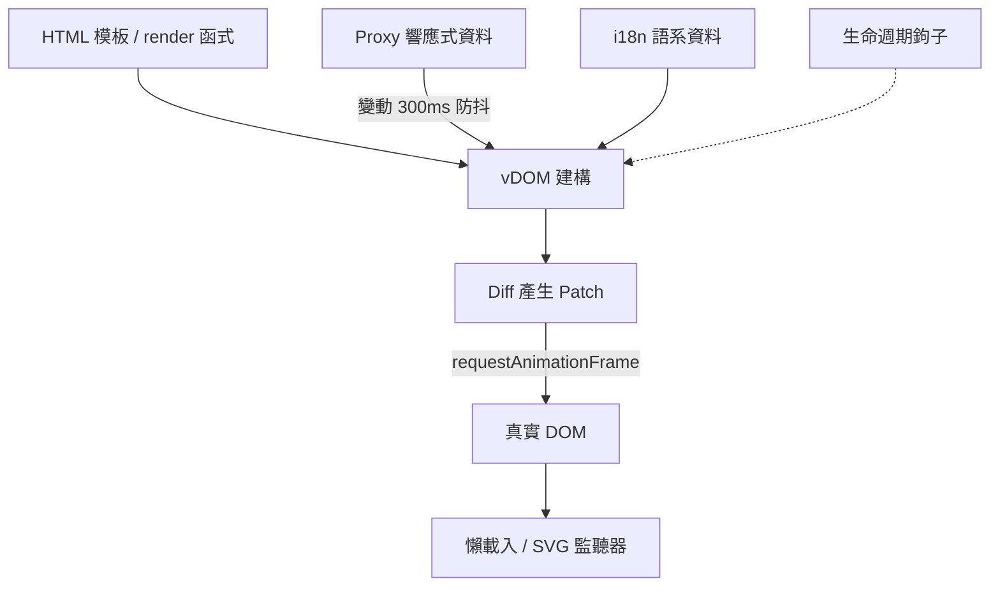

> [!NOTE]
> 此 README 由 [SKILL](https://github.com/agenvoy/skill-readme-generate) 生成，英文版請參閱 [這裡](../README.md)。

***

<strong>A ZERO-DEPENDENCY VIRTUAL DOM FRAMEWORK THAT RUNS WITHOUT A BUILD STEP</strong>

***

> 原生 JavaScript 前端框架，具備虛擬 DOM 差異更新、宣告式 HTML 模板與內建多語系切換

## 目錄

- [功能特點](#功能特點)
- [架構](#架構)
- [授權](#授權)
- [Author](#author)

## 功能特點

> `npm i @pardnchiu/quickui` · [完整文件](./doc.zh.md)

- **零相依免建置** — 以瀏覽器原生 API 實作虛擬 DOM（Virtual DOM）的 Diff／Patch，一個 script 標籤即可在既有頁面上使用。
- **宣告式 HTML 模板** — 資料插值、迴圈、條件分支、雙向綁定與事件綁定直接寫在 HTML 屬性上，模板即是頁面本身。
- **Proxy 響應式批次更新** — 深層資料變動自動觸發 300ms 防抖更新，並於下一個動畫影格只套用必要的 DOM 差異。
- **執行期 i18n 切換** — 語系可直接給物件或 JSON 檔網址，呼叫一次語系切換即重新渲染文字與屬性。
- **內建圖片懶載入與 SVG 內嵌** — 以 IntersectionObserver 延遲載入圖片並附載入動畫，外部 SVG 檔進入視窗時自動內嵌為可上色的節點。

## 架構

> [完整架構](./architecture.zh.md)

## 授權

本專案採用 [MIT LICENSE](../LICENSE)。

## Author

Just [open an issue](https://github.com/pardnchiu/QuickUI/issues/new) to share an idea.

***

©️ 2024 [邱敬幃 Pardn Chiu](https://www.linkedin.com/in/pardnchiu)
