# QuickUI - Architecture

> Back to [README](../README.md)

## Overview

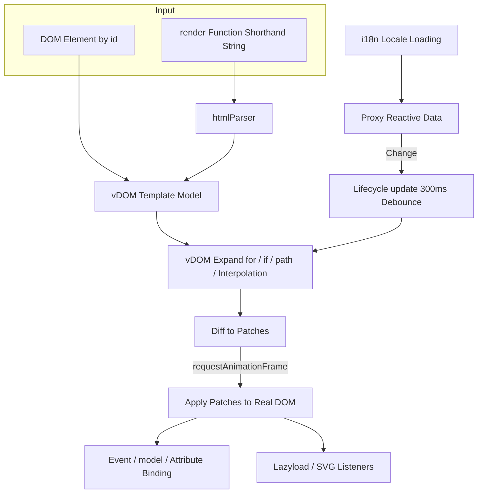

## Module: Template Parser (htmlParser)

Parses the shorthand string returned by `render` (`tag#id.class(attr)[children]`) into an element tree that vDOM uses as the template model.

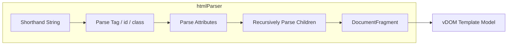

## Module: vDOM

Builds a new virtual tree from the template model and data, then diffs it against the previous tree to emit patches.

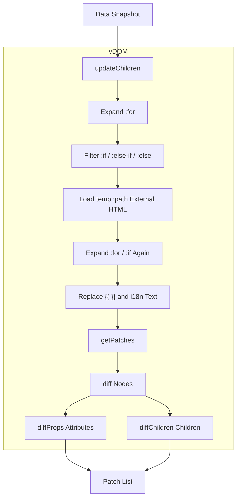

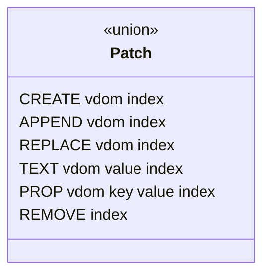

## Module: QUI Core

Handles initialization, render scheduling, patch application, and interaction binding.

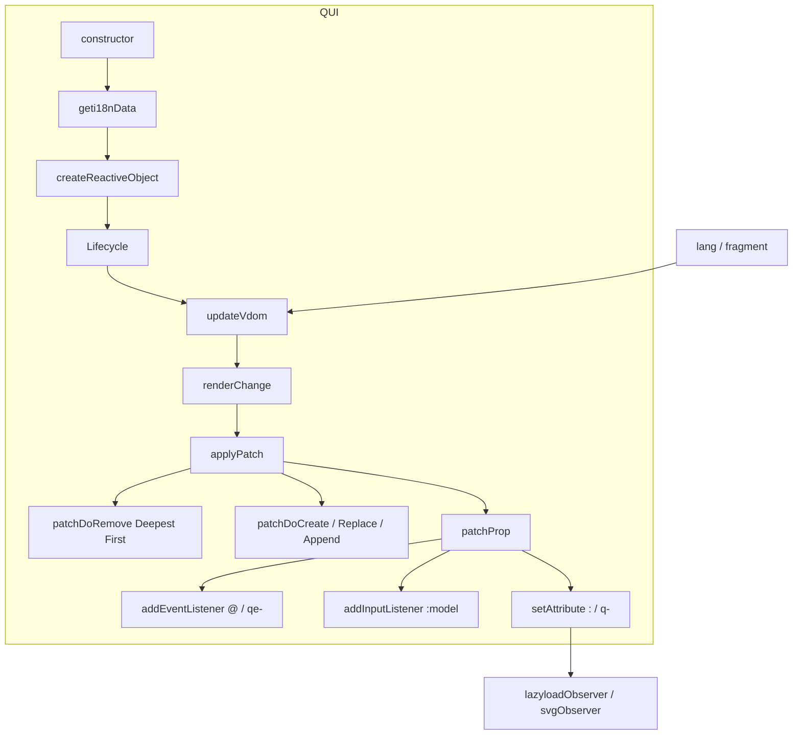

## Module: Reactive Data

`createReactiveObject` wraps data in recursive Proxies and reports the changed path to trigger an update.

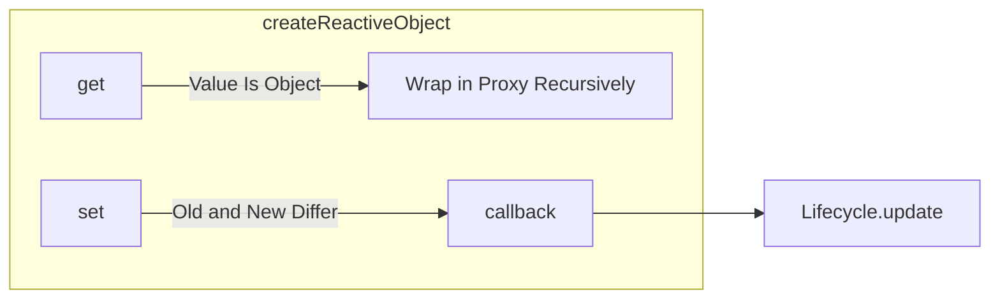

## Module: Lifecycle

Wraps the render, update, and destroy flows with abortable pre-hooks and timed post-hooks.

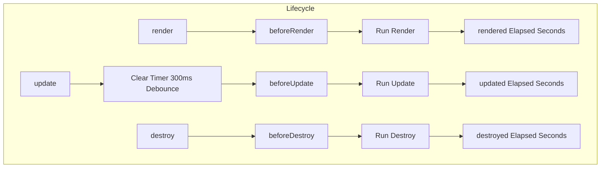

## Module: Listeners

Uses IntersectionObserver to defer images and SVGs until they enter the viewport.

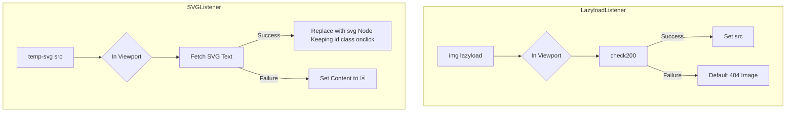

## Module: Global Utilities

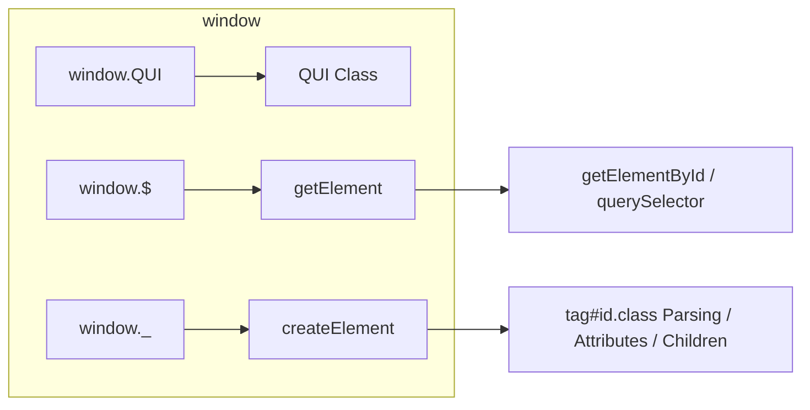

## Data Flow

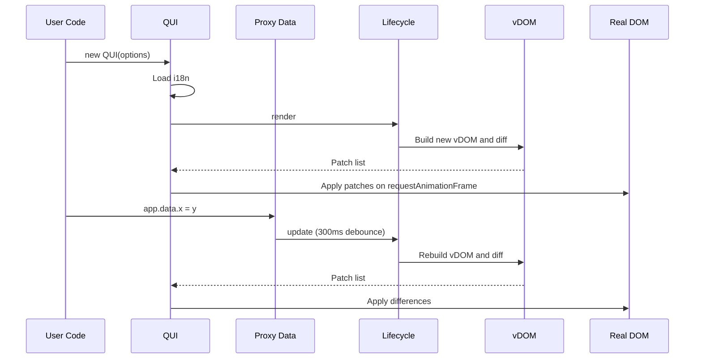

## State Machine

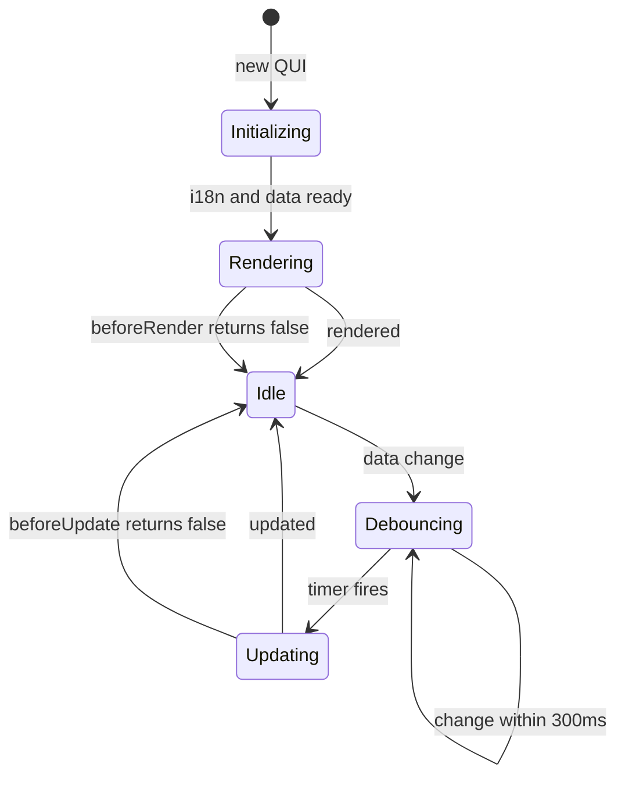

***

©️ 2024 [邱敬幃 Pardn Chiu](https://www.linkedin.com/in/pardnchiu)
