# QuickUI - 架構

> 返回 [README](./README.zh.md)

## 概覽

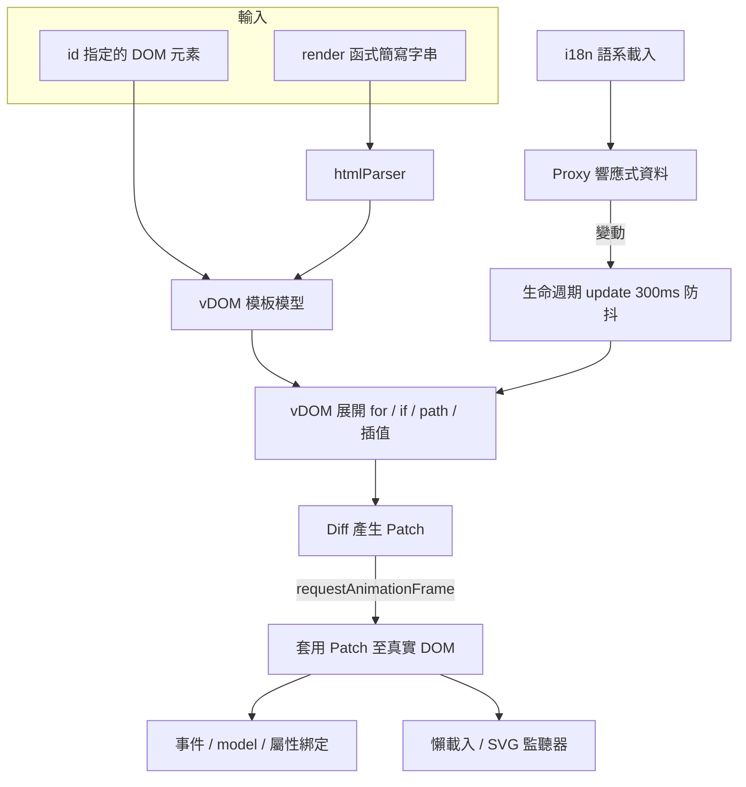

## Module: 模板解析（htmlParser）

將 `render` 回傳的簡寫字串（`tag#id.class(attr)[children]`）解析為元素樹，供 vDOM 建立模板模型。

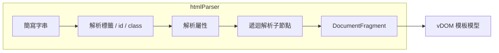

## Module: vDOM

以模板模型與資料產生新的虛擬樹，並與上一棵樹比對輸出 Patch。

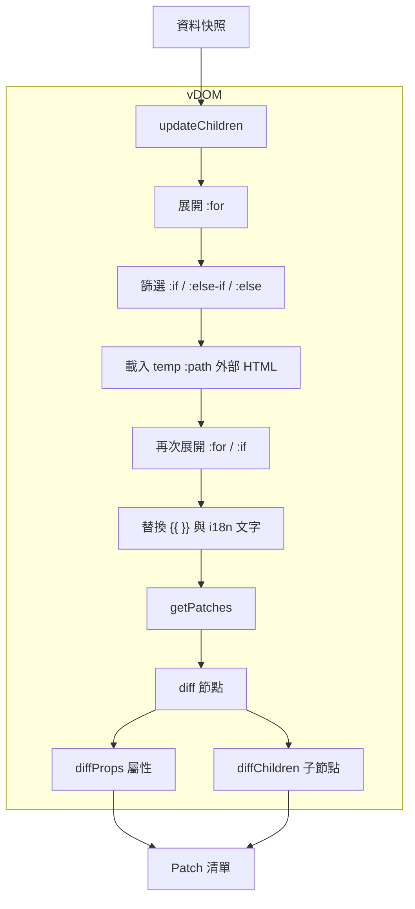

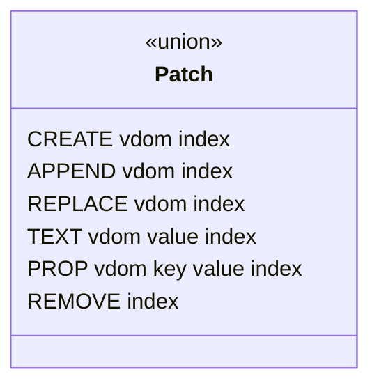

## Module: QUI 核心

負責初始化、排程渲染、套用 Patch 與綁定互動行為。

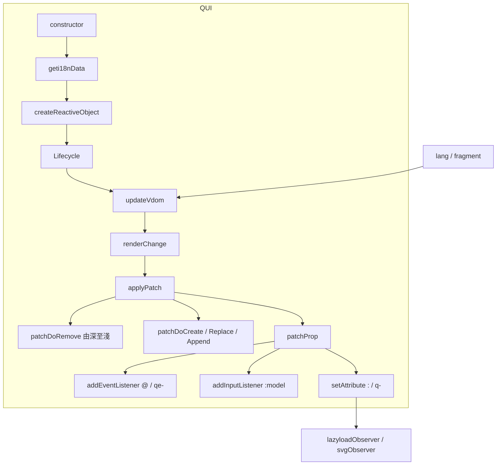

## Module: 響應式資料

`createReactiveObject` 以遞迴 Proxy 包裝資料，值改變時回報路徑並觸發更新。

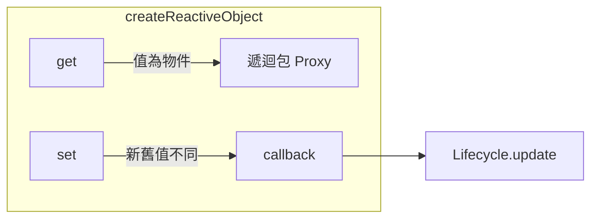

## Module: 生命週期

包裝渲染、更新、銷毀三種流程，提供前置中止與後置計時回呼。

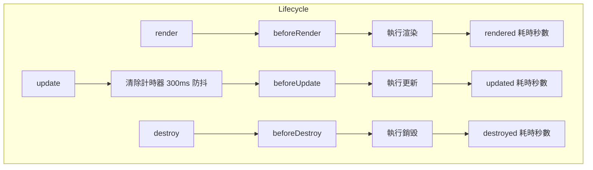

## Module: 監聽器

以 IntersectionObserver 延遲處理進入視窗的圖片與 SVG。

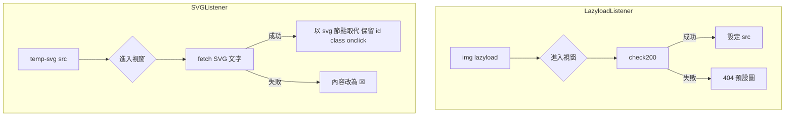

## Module: 全域工具

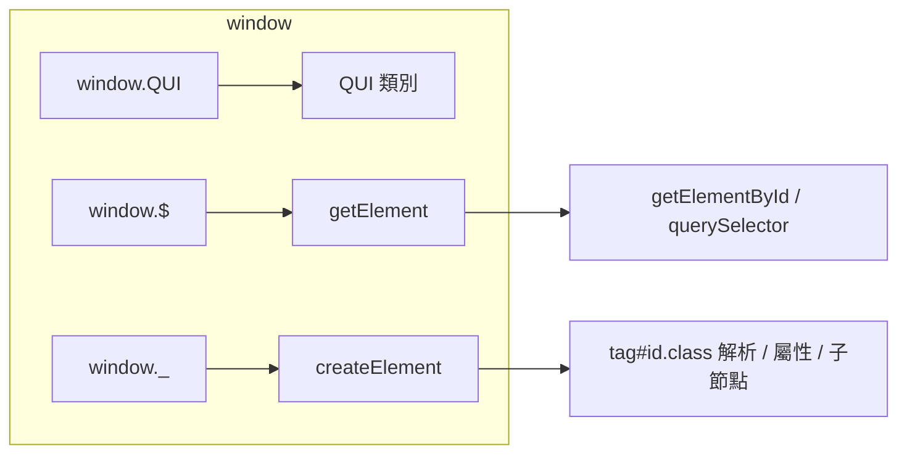

## 資料流

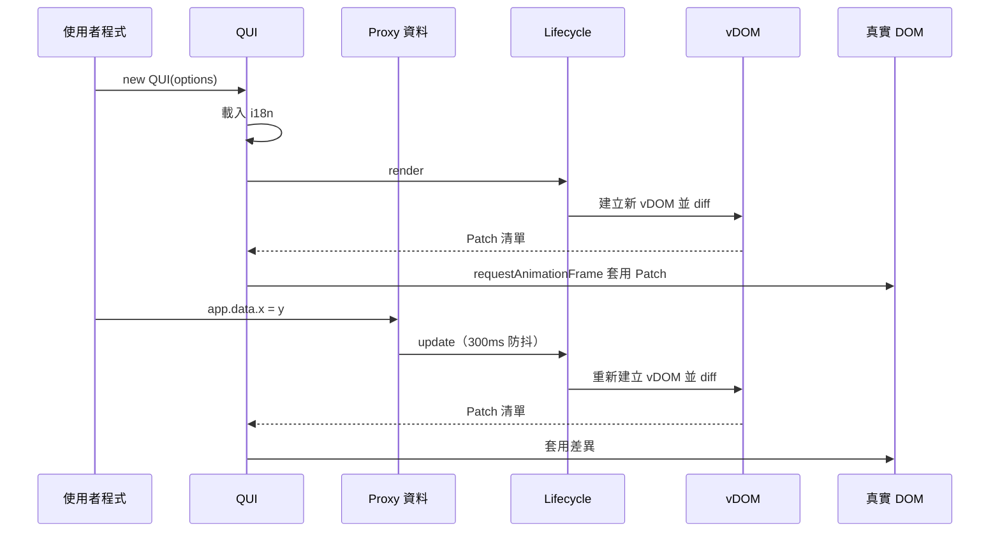

## 狀態機

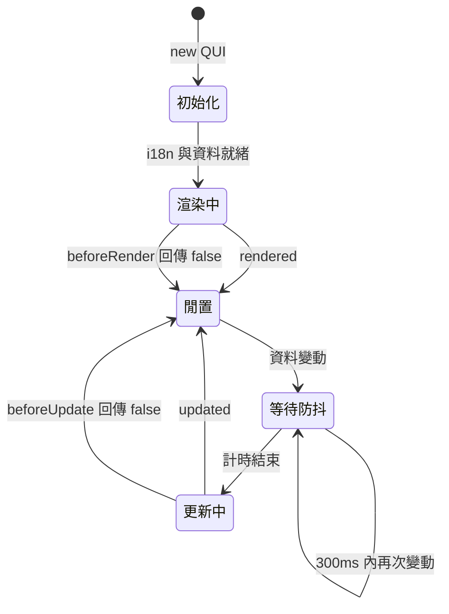

***

©️ 2024 [邱敬幃 Pardn Chiu](https://www.linkedin.com/in/pardnchiu)
